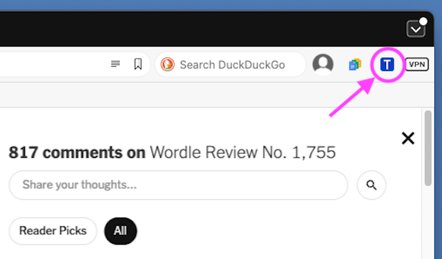
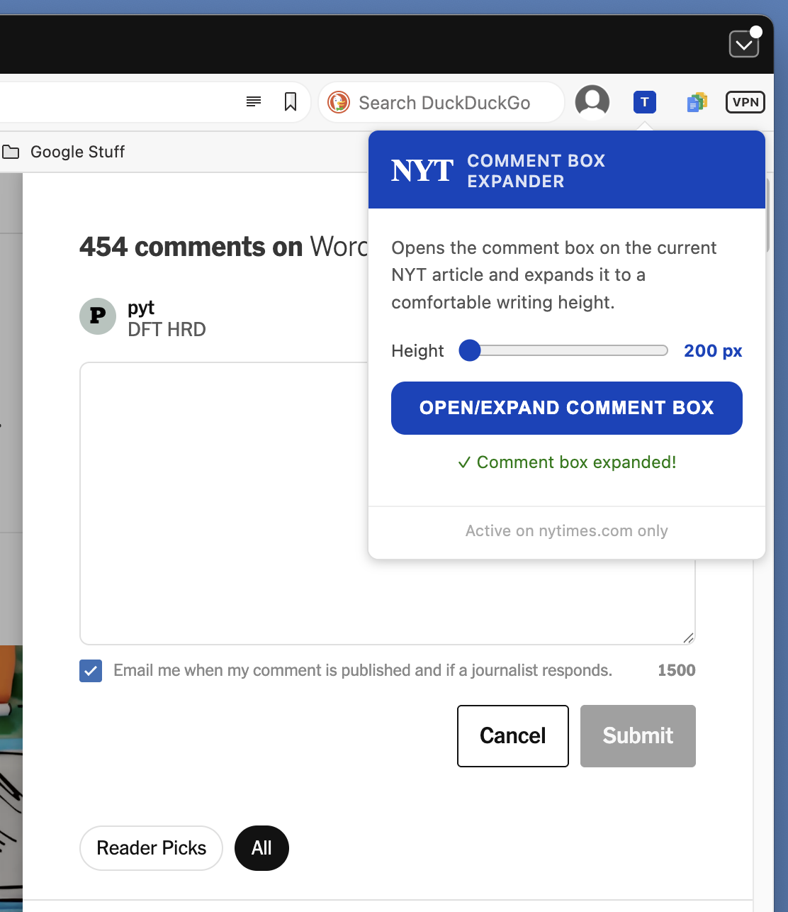
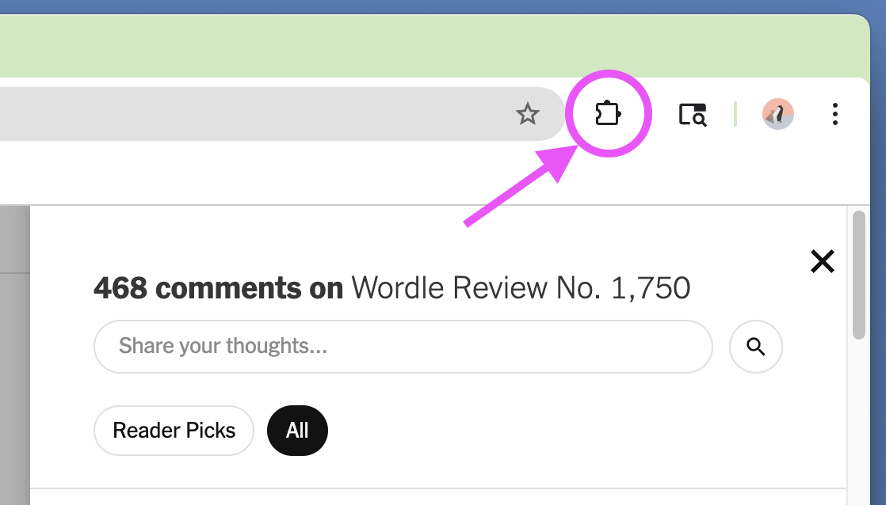
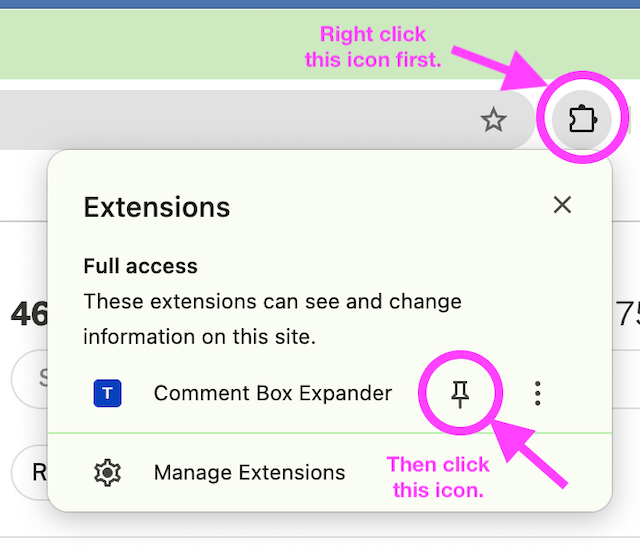
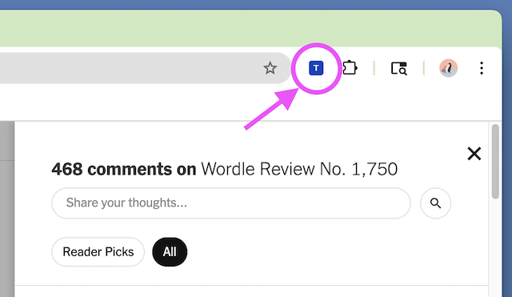

# nyt-commentbox-szr

* A Chrome browser extension that opens and automatically expands the New York Times new comments entry box to a convenient size. This extension should work in any browser that supports Chrome browser extensions.
* Apple's Safari and possibly other browsers do not support Chrome browser extensions.

### For Example

* Starting with the comments section open ***and being logged in to your NYT account.***

* Clicking the **nyt_commentbox_szr** extension icon shown in the above image results in:
  

* At which point clicking anywhere not in the **NYT COMMENT BOX EXPANDER** dismisses the extension.

### More Information

#### Height Slider

* The Height slider sets the comment box's expanded height.
* Change the slider's height position and press the **OPEN/EXPAND COMMENT BOX** button. The comment box size will change to the new setting. This setting is remembered.

#### Something To Know

* This extension operates on the mechanism the NYT provides for entering new comments. That mechanism can only be loaded when you are logged into a NYT account and have clicked onto "Share your thoughts...", which you only see presented when the comments section is showing. This is why this extension works only when the comments section is showing and you are logged in. Otherwise, the extension reports it cannot find what it needs.

### Installation

* Web browser extensions consist of some files  in a folder that you inform your web browser is an extension.
* To install you will be downloading a zip file, "nyt_commentbox_szr_extension.zip". Find "Releases" on this webpage at the right hand side to navigate where you can download the zip file.
* The zip file when unzipped results in a folder named "nyt_commentbox_szr_extension".
* Find your way to your web browser's Manage Extensions. Often this is accomplished by right clicking on an extension icon already showing the upper right corner.
* Once at Manage Extensions, select "Load unpacked". Then select the folder named "nyt_commentbox_szr_extension". The extension will be loaded. Depending on what web browser you have, the extension's icon might already be pinned in the tool bar.

#### If Using the Chrome Web Browser

* The Chrome web browser might not pin the new loaded extension icon in the tool. You might see this:
  
* If that is the case, then first right click on the upper icon to reveal a popup. On that popup pick the pin icon for the Comment Box Expander.
  
* The extension's icon should now be visible at the toolbar.
